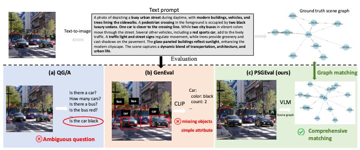
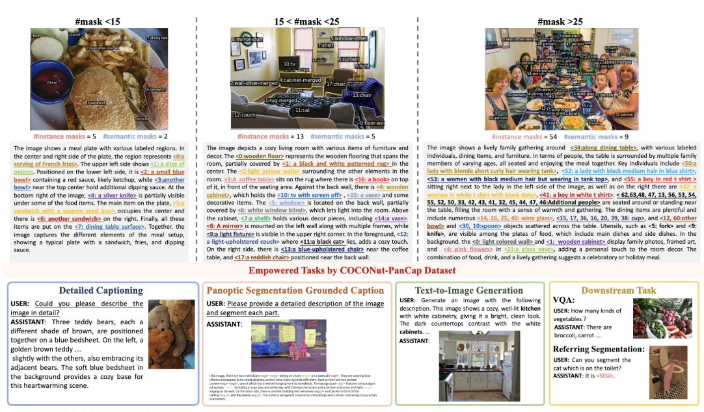
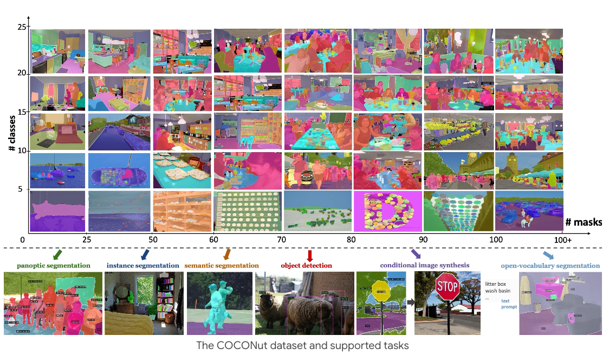

I'm currently a research scientist at [ByteDance Seed Research](https://seed.bytedance.com/en/) and I joined ByteDance since 2022. During ByteDance, I am fortunate to work under the supervision from [Dr. Liang-Chieh Chen](https://scholar.google.com/citations?user=ACjYGPUAAAAJ&hl=en) and [Dr. Xiaohui Shen](https://scholar.google.com/citations?user=pViZYwIAAAAJ&hl=en).  Before joining ByteDance, I achieved my PhD degree in EECS from University of California in 2021, Merced advised by [Prof. Shawn Newsam](https://scholar.google.com/citations?view_op=list_works&hl=en&hl=en&user=pQZX0mEAAAAJ&sortby=pubdate) and worked closely with [Dr. Yi Zhu](https://scholar.google.com/citations?user=IXw4UiwAAAAJ&hl=en) during my PhD. Before that, I achieved my BS dregree from Sun Yat-Sen University, China.

You can find my resume here: [Xueqing Deng's Resume](../assets/cv_xueqing.pdf)

[Google Scholar](https://scholar.google.com/citations?user=UGhyv2UAAAAJ&hl=en)/[Github](https://github.com/xdeng7)

Research Interests
------
I am recently interested in multimodal learning for visual generation including both image and video.

News!
------
1. Two ICCV2025 have been accepted!
2. One CPVR2025 has been accepted!

Selected Work
------
<table border="0" style="border-collapse: collapse;">
  <tr>
    <td style="padding-right:10px; vertical-align:top;">
      
    </td>
    <td style="vertical-align:top;">
      <a href="https://your-paper-link.com" style="font-size:16px; font-weight:bold; text-decoration:none;">
        Leveraging Panoptic Scene Graph for Evaluating Fine-Grained Text-to-Image Generation
      </a> 
      <b><u>Xueqing Deng</u></b>, Linjie Yang, Qihang Yu, Chenglin Yang, Liang-Chieh Chen 
      <em>ICCV, 2025</em> 
      <a href="https://your-paper-link.com">coming</a> /
      <a href="https://your-project-link.com">coming</a>
    </td>
  </tr>
    <tr>
    <td style="padding-right:10px; vertical-align:top;">
      
    </td>
    <td style="vertical-align:top;">
      <a href="https://your-paper-link.com" style="font-size:16px; font-weight:bold; text-decoration:none;">
        COCONut-PanCap: Joint Panoptic Segmentation and Grounded Captions for Fine-Grained Understanding and Generation
      </a> 
     <b><u>Xueqing Deng</u></b>, Linjie Yang, Qihang Yu, Ali Athar, Chenglin Yang, Xiaojie Jin, Xiaohui Shen, Liang-Chieh Chen   
      <em>arxiv, 2025</em> 
      <a href="https://arxiv.org/abs/2502.02589">paper</a> /
      <a href="https://xdeng7.github.io/coconut.github.io/coconut_pancap.html">webpage</a>
    </td>
  </tr>
      <tr>
    <td style="padding-right:10px; vertical-align:top;">
      
    </td>
    <td style="vertical-align:top;">
      <a href="https://your-paper-link.com" style="font-size:16px; font-weight:bold; text-decoration:none;">
        COCONut: Modernizing COCO Segmentation
      </a> 
     <b><u>Xueqing Deng</u></b>, Qihang Yu, Peng Wang, Xiaohui Shen, Liang-Chieh Chen   
      <em>CVPR, 2024</em> 
      <a href="https://openaccess.thecvf.com/content/CVPR2024/papers/Deng_COCONut_Modernizing_COCO_Segmentation_CVPR_2024_paper.pdf">paper</a> /
      <a href="https://xdeng7.github.io/coconut.github.io/">webpage</a>
    </td>
  </tr>
       <tr>
    <td style="padding-right:10px; vertical-align:top;">
      
    </td>
    <td style="vertical-align:top;">
      <a href="https://your-paper-link.com" style="font-size:16px; font-weight:bold; text-decoration:none;">
        DistPro: Searching A Fast Knowledge Distillation Process via Meta Optimization
      </a> 
     <b><u>Xueqing Deng*</u></b>, Dawei Sun*, Shawn Newsam and Peng Wang (* denotes co-first author)   
      <em>ECCV, 2022</em> 
      <a href="https://openaccess.thecvf.com/content/CVPR2022/html/Deng_NightLab_A_Dual-Level_Architecture_With_Hardness_Detection_for_Segmentation_at_CVPR_2022_paper.html">paper</a> /
    </td>
  </tr>
   <tr>
    <td style="padding-right:10px; vertical-align:top;">
      
    </td>
    <td style="vertical-align:top;">
      <a href="https://your-paper-link.com" style="font-size:16px; font-weight:bold; text-decoration:none;">
        NightLab: A Dual-Level Architecture With Hardness Detection for Segmentation at Night
      </a> 
     <b><u>Xueqing Deng</u></b>, Peng Wang, Xiaochen Lian, Shawn Newsam   
      <em>CVPR, 2022</em> 
      <a href="https://openaccess.thecvf.com/content/CVPR2022/html/Deng_NightLab_A_Dual-Level_Architecture_With_Hardness_Detection_for_Segmentation_at_CVPR_2022_paper.html">paper</a> /
    </td>
  </tr>

</table>

